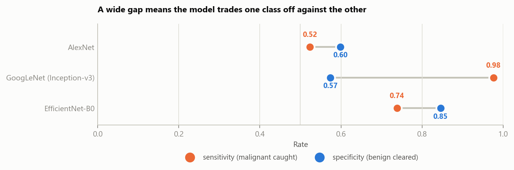
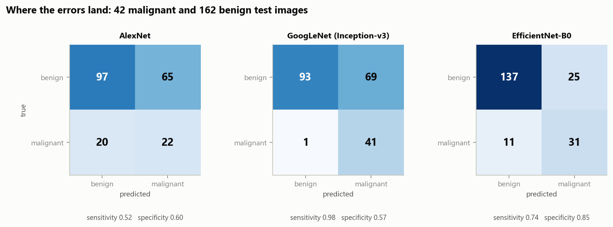
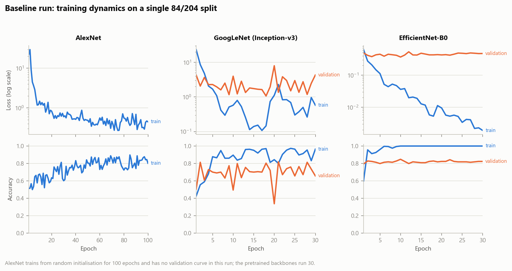

# Results

Two things live in this document: the numbers that have actually been measured, and
the specification of what the full benchmark produces when run. They are kept apart
on purpose — a results file that blurs "measured" into "expected" is not a results
file.

---

## Status

| | |
|---|---|
| **Baseline run** — 3 architectures, single split | measured, below |
| **Full benchmark** — 7 architectures, 3×5-fold | harness complete, not yet run |

The full benchmark requires the dataset locally and roughly 1–2 GPU-hours. See
[REPRODUCIBILITY.md](REPRODUCIBILITY.md).

---

## Baseline run

A single-split feasibility run across three architectures, spanning the transition
from pre-transfer-learning (AlexNet, 2012) to compound scaling (EfficientNet-B0, 2019).

**Protocol.** The dataset's own `Training`/`Testing` directories (84 / 204), no
cross-validation. Pretrained backbones frozen, 256-unit head, Adam, batch 16, 30
epochs; AlexNet from random initialisation for 100 epochs. Decision by argmax.
Hardware: one RTX 3050 Ti (laptop). Raw counts in
[`results/baseline_run/confusion_matrices.json`](../results/baseline_run/confusion_matrices.json).

| Model | Year | Accuracy | Balanced acc. | Sensitivity | Specificity | MCC | Train time |
|---|---:|---:|---:|---:|---:|---:|---:|
| AlexNet | 2012 | 58.3% | 0.561 | 0.524 | 0.599 | 0.100 | 2m 40s |
| GoogLeNet (Inception-v3) | 2014 | 65.7% | 0.775 | 0.976 | 0.574 | 0.446 | 1m 51s |
| **EfficientNet-B0** | 2019 | **82.4%** | **0.792** | 0.738 | **0.846** | **0.529** | 1m 24s |

No ROC-AUC is listed because this run retained only hard predictions, not probability
scores. That is precisely why the benchmark harness persists per-image scores to
`results/<name>/test_scores.npy` — threshold-free metrics cannot be recovered after
the fact.

### Reading the table

**Accuracy alone ranks these models wrong.** A model that answers "benign" for all 204
test images scores **79.4%** — beating two of the three rows above while catching zero
cancers. Accuracy is in the table for comparability with published work, not as the
verdict.



**GoogLeNet and EfficientNet fail in opposite directions, and the gap matters more
than the accuracy difference between them.** GoogLeNet catches 41 of 42 malignant
lesions — 0.98 sensitivity, the best of the three — but only clears 57% of benign
lesions, flagging 69 healthy cases. EfficientNet is far more balanced (0.74 / 0.85)
and has the best balanced accuracy and MCC, but it misses 11 malignant lesions where
GoogLeNet misses 1.

Which is preferable is a question about deployment, not about accuracy. In a screening
setting where a false positive costs a dermatologist referral and a false negative
costs a missed melanoma, GoogLeNet's error profile is arguably the more defensible
one, despite scoring 17 accuracy points lower. This is the reason the benchmark
harness selects an explicit operating point rather than reporting argmax accuracy —
see `eval.operating_point` in the configs.



**AlexNet is close to uninformative here.** MCC 0.10 against a random-baseline 0.0. It
is doing slightly better than chance and no more, which is the expected outcome for a
network trained from random initialisation on 84 images, and is the reason it is
included at all: it marks how much of every other row is attributable to ImageNet
pretraining rather than to architecture.



**The curves show the small-data regime plainly.** EfficientNet reaches 100% training
accuracy by epoch 10 and drives its training loss down to ~2×10⁻³, while validation
accuracy sits flat at ~0.82 for the remaining 20 epochs — memorisation, not learning.
GoogLeNet's
validation loss oscillates between 1.2 and 4.3 across the whole run, ending on a
local high; with 6 gradient steps per epoch, adjacent epochs are barely correlated,
and reporting whichever epoch happened to be last is close to sampling noise.

Both observations are why the benchmark harness runs early stopping on `val_AUC` with
best-weight restoration, and reports a mean over 15 runs rather than a final-epoch
number.

---

## Full benchmark

Seven architectures under one protocol: the four compared by the reference paper
(VGG-16, VGG-19, ResNet-50, DenseNet-121) plus the three above.

```bash
skin-benchmark benchmark --all      # 3 × 5-fold per architecture
skin-benchmark report               # writes results/benchmark.{md,csv}
```

Each architecture produces `results/<name>/results.json` containing per-fold
scorecards, the fold-level mean and spread, the fold-ensemble score with bootstrap
intervals, per-fold training histories, and a run manifest (git commit, library
versions, GPUs). `skin-benchmark report` collapses those into:

| Model | Year | Source | ROC-AUC | AP | Balanced acc. | Sensitivity | Specificity | Accuracy | MCC |
|---|---|---|---|---|---|---|---|---|---|
| AlexNet | 2012 | added | | | | | | | |
| VGG-16 | 2014 | paper | | | | | | | |
| VGG-19 | 2014 | paper | | | | | | | |
| GoogLeNet (Inception-v3) | 2014 | added | | | | | | | |
| ResNet-50 | 2015 | paper | | | | | | | |
| DenseNet-121 | 2017 | paper | | | | | | | |
| EfficientNet-B0 | 2019 | added | | | | | | | |

Values are `mean ± std` over 15 runs (3 seeds × 5 folds).

**Do not fill this table by copying the published accuracies.** The paper's numbers
come from a different split of a larger dataset under an unspecified protocol; the
point of re-running all seven here is that a comparison across those two settings
cannot be made. See [LIMITATIONS.md](LIMITATIONS.md#comparison-to-published-work).

---

## Reference paper, for context

Surendren D. and Sumitha J., "Skin Cancer Detection using Convolutional Neural Network
Models: VGG-16, VGG-19, ResNet and DenseNet," *ICDICI 2024*, pp. 1254–1258.
[doi:10.1109/ICDICI62993.2024.10810998](https://doi.org/10.1109/ICDICI62993.2024.10810998)

| Model | Reported accuracy |
|---|---:|
| VGG-16 | 72.6% |
| VGG-19 | 73.2% |
| ResNet | 82.4% |
| DenseNet | **84.4%** |

Reported on 2,367 training / 660 test images. Precision, recall and accuracy only; no
AUC, no confidence intervals, no operating point stated.
