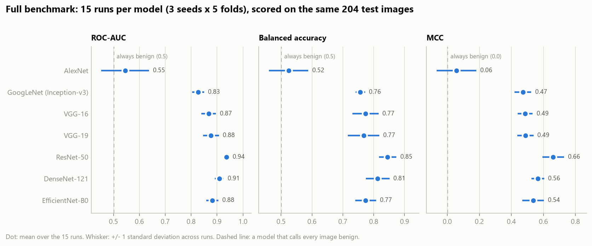

# Results

Two sets of measured numbers live in this document: an early single-split baseline
and the full benchmark. They are kept apart on purpose — they come from different
protocols, and a results file that blurs one into the other is not a results file.

---

## Status

| | |
|---|---|
| **Baseline run** — 3 architectures, single split | measured, below |
| **Full benchmark** — 7 architectures, 3×5-fold | measured 2026-09-24, [below](#full-benchmark) |

The full benchmark took **1 h 57 min** of wall-clock time on one NVIDIA RTX 4060 Ti
(8 GB). Run record in [Run record](#run-record); setup in
[REPRODUCIBILITY.md](REPRODUCIBILITY.md).

---

## Baseline run

A single-split feasibility run across three architectures, spanning the transition
from pre-transfer-learning (AlexNet, 2012) to compound scaling (EfficientNet-B0, 2019).

**Protocol.** The dataset's own `Training`/`Testing` directories (84 / 204), no
cross-validation. Pretrained backbones frozen, 256-unit head, Adam, batch 16, 30
epochs; AlexNet from random initialisation for 100 epochs. Decision by argmax.
Hardware: one RTX 3050 Ti (laptop). Raw counts in
[`results/baseline_run/confusion_matrices.json`](../results/baseline_run/confusion_matrices.json).

| Model | Year | Accuracy | Balanced acc. | Sensitivity | Specificity | MCC | Train time |
|---|---:|---:|---:|---:|---:|---:|---:|
| AlexNet | 2012 | 58.3% | 0.561 | 0.524 | 0.599 | 0.100 | 2m 40s |
| GoogLeNet (Inception-v3) | 2014 | 65.7% | 0.775 | 0.976 | 0.574 | 0.446 | 1m 51s |
| **EfficientNet-B0** | 2019 | **82.4%** | **0.792** | 0.738 | **0.846** | **0.529** | 1m 24s |

No ROC-AUC is listed because this run retained only hard predictions, not probability
scores. That is precisely why the benchmark harness persists per-image scores to
`results/<name>/test_scores.npy` — threshold-free metrics cannot be recovered after
the fact.

### Reading the table

**Accuracy alone ranks these models wrong.** A model that answers "benign" for all 204
test images scores **79.4%** — beating two of the three rows above while catching zero
cancers. Accuracy is in the table for comparability with published work, not as the
verdict.


**GoogLeNet and EfficientNet fail in opposite directions, and the gap matters more
than the accuracy difference between them.** GoogLeNet catches 41 of 42 malignant
lesions — 0.98 sensitivity, the best of the three — but only clears 57% of benign
lesions, flagging 69 healthy cases. EfficientNet is far more balanced (0.74 / 0.85)
and has the best balanced accuracy and MCC, but it misses 11 malignant lesions where
GoogLeNet misses 1.

Which is preferable is a question about deployment, not about accuracy. In a screening
setting where a false positive costs a dermatologist referral and a false negative
costs a missed melanoma, GoogLeNet's error profile is arguably the more defensible
one, despite scoring 17 accuracy points lower. This is the reason the benchmark
harness selects an explicit operating point rather than reporting argmax accuracy —
see `eval.operating_point` in the configs.


**AlexNet is close to uninformative here.** MCC 0.10 against a random-baseline 0.0. It
is doing slightly better than chance and no more, which is the expected outcome for a
network trained from random initialisation on 84 images, and is the reason it is
included at all: it marks how much of every other row is attributable to ImageNet
pretraining rather than to architecture.


**The curves show the small-data regime plainly.** EfficientNet reaches 100% training
accuracy by epoch 10 and drives its training loss down to ~2×10⁻³, while validation
accuracy sits flat at ~0.82 for the remaining 20 epochs — memorisation, not learning.
GoogLeNet's
validation loss oscillates between 1.2 and 4.3 across the whole run, ending on a
local high; with 6 gradient steps per epoch, adjacent epochs are barely correlated,
and reporting whichever epoch happened to be last is close to sampling noise.

Both observations are why the benchmark harness runs early stopping on `val_AUC` with
best-weight restoration, and reports a mean over 15 runs rather than a final-epoch
number.

---

## Full benchmark

Seven architectures under one protocol: the four compared by the reference paper
(VGG-16, VGG-19, ResNet-50, DenseNet-121) plus the three above.

```bash
skin-benchmark benchmark --all      # 3 × 5-fold per architecture
skin-benchmark report               # writes results/benchmark.{md,csv}
```

Each architecture produces `results/<name>/results.json` containing per-fold
scorecards, the fold-level mean and spread, the fold-ensemble score with bootstrap
intervals, per-fold training histories, and a run manifest (git commit, library
versions, GPUs). `skin-benchmark report` collapses those into the table below.

### Measured, 2026-09-24

One uninterrupted `skin-benchmark benchmark --all` at commit `df7a9dc`, shipped
configs, no overrides. Copied from
[`results/benchmark.csv`](../results/benchmark.csv) at the rounding
`skin-benchmark report` uses ([`results/benchmark.md`](../results/benchmark.md)).

| Model | Year | Source | ROC-AUC | AP | Balanced acc. | Sensitivity | Specificity | Accuracy | MCC |
|---|---|---|---|---|---|---|---|---|---|
| AlexNet | 2012 | added | 0.545 ± 0.092 | 0.301 ± 0.085 | 0.525 ± 0.064 | 0.446 ± 0.229 | 0.603 ± 0.278 | 0.571 ± 0.180 | 0.057 ± 0.124 |
| GoogLeNet (Inception-v3) | 2014 | added | 0.827 ± 0.023 | 0.672 ± 0.048 | 0.756 ± 0.015 | 0.687 ± 0.071 | 0.826 ± 0.074 | 0.797 ± 0.046 | 0.472 ± 0.052 |
| VGG-16 | 2014 | paper | 0.868 ± 0.028 | 0.625 ± 0.069 | 0.774 ± 0.042 | 0.752 ± 0.155 | 0.795 ± 0.092 | 0.786 ± 0.047 | 0.487 ± 0.047 |
| VGG-19 | 2014 | paper | 0.877 ± 0.030 | 0.680 ± 0.050 | 0.767 ± 0.051 | 0.722 ± 0.174 | 0.812 ± 0.089 | 0.794 ± 0.041 | 0.487 ± 0.050 |
| ResNet-50 | 2015 | paper | 0.937 ± 0.008 | 0.848 ± 0.021 | 0.845 ± 0.029 | 0.800 ± 0.103 | 0.890 ± 0.080 | 0.872 ± 0.047 | 0.661 ± 0.068 |
| DenseNet-121 | 2017 | paper | 0.909 ± 0.017 | 0.773 ± 0.027 | 0.813 ± 0.038 | 0.802 ± 0.140 | 0.824 ± 0.083 | 0.820 ± 0.042 | 0.565 ± 0.040 |
| EfficientNet-B0 | 2019 | added | 0.882 ± 0.023 | 0.748 ± 0.040 | 0.774 ± 0.034 | 0.690 ± 0.146 | 0.857 ± 0.109 | 0.823 ± 0.061 | 0.536 ± 0.067 |

Values are `mean ± std` over 15 runs (3 seeds × 5 folds). Each run is one model,
fitted on 67–68 training images, with its decision threshold chosen on its own 16–17
validation images (Youden's J) and then scored once on all 204 test images.



**These numbers are not comparable to the published accuracies, and no delta between
them should be computed.** The paper's numbers come from a different split of a
larger dataset under an unspecified protocol; the point of re-running all seven here
is that a comparison across those two settings cannot be made. See
[LIMITATIONS.md](LIMITATIONS.md#comparison-to-published-work).

### Against a model that does nothing

The reference is a model that answers "benign" for every test image. On this test
split it scores **accuracy 0.794** (162 / 204), sensitivity 0.000, specificity 1.000,
balanced accuracy 0.500, MCC 0.000 and ROC-AUC 0.500 (a constant score ranks nothing).
Its predictions do not depend on the image, so every bootstrap replicate gives it the
same values.

**How "separated" is decided.** Two intervals accompany every number, and they answer
different questions:

- **Run-to-run spread** — `mean ± std` across the 15 runs above. This is training
  noise: which images a fold was fitted on, and the seed.
- **Test-sampling interval** — a stratified bootstrap 95% interval (2,000 resamples)
  over the 204 test images, computed for the *fold ensemble*: the mean of the 15
  models' test probabilities, thresholded at the mean of their 15 validation-chosen
  thresholds. This is the noise of having only 42 malignant and 162 benign test images.

A difference is called **separated** only when *neither* interval overlaps. Anything
else is treated as unseparated, as [LIMITATIONS.md](LIMITATIONS.md#statistical) asks.
The harness runs no paired significance test.

Fold ensemble, value and bootstrap 95% interval:

| Model | ROC-AUC | Balanced acc. | Sensitivity | Specificity | MCC | Accuracy |
|---|---|---|---|---|---|---|
| AlexNet | 0.553 [0.451, 0.657] | 0.543 [0.462, 0.622] | 0.357 [0.214, 0.500] | 0.728 [0.660, 0.796] | 0.076 [−0.067, 0.217] | 0.652 [0.588, 0.711] |
| GoogLeNet (Inception-v3) | 0.842 [0.761, 0.911] | 0.774 [0.696, 0.845] | 0.690 [0.548, 0.833] | 0.858 [0.802, 0.907] | 0.509 [0.370, 0.638] | 0.824 [0.770, 0.873] |
| VGG-16 | 0.903 [0.856, 0.942] | 0.830 [0.762, 0.888] | 0.833 [0.714, 0.929] | 0.827 [0.765, 0.883] | 0.578 [0.461, 0.692] | 0.828 [0.775, 0.877] |
| VGG-19 | 0.915 [0.868, 0.951] | 0.813 [0.741, 0.881] | 0.762 [0.619, 0.881] | 0.864 [0.809, 0.914] | 0.574 [0.445, 0.700] | 0.843 [0.794, 0.892] |
| ResNet-50 | 0.947 [0.904, 0.979] | 0.877 [0.810, 0.933] | 0.833 [0.714, 0.929] | 0.920 [0.877, 0.957] | 0.718 [0.602, 0.824] | 0.902 [0.858, 0.941] |
| DenseNet-121 | 0.924 [0.874, 0.962] | 0.831 [0.765, 0.897] | 0.810 [0.690, 0.929] | 0.852 [0.790, 0.907] | 0.593 [0.475, 0.718] | 0.843 [0.794, 0.892] |
| EfficientNet-B0 | 0.900 [0.840, 0.951] | 0.811 [0.736, 0.879] | 0.714 [0.571, 0.833] | 0.907 [0.858, 0.951] | 0.606 [0.473, 0.736] | 0.868 [0.824, 0.912] |

The ensemble pools 15 models, so it is a different estimate from the fold mean — here
it is higher in 41 of these 42 cells. The fold means in the first table are the
per-model estimate; the ensemble is shown for its test-sampling interval.

### Reading the table

**1. All six ImageNet-pretrained backbones outperform always-benign on ROC-AUC,
balanced accuracy and MCC. AlexNet does not.** For each pretrained backbone both
intervals clear the reference on all three metrics; the closest is GoogLeNet
(Inception-v3) at ROC-AUC 0.827 ± 0.023, bootstrap [0.761, 0.911], against 0.500.
AlexNet, the one model trained from random initialisation, overlaps the reference on
all three — ROC-AUC 0.545 ± 0.092 [0.451, 0.657], balanced accuracy 0.525 ± 0.064,
MCC 0.057 ± 0.124 [−0.067, 0.217]. On 84 training images this experiment cannot tell it
apart from a model that ignores the image. Because AlexNet is also the only model
without pretraining, the gap reflects pretraining and architecture together, not
architecture alone (see [LIMITATIONS.md](LIMITATIONS.md#methodological)).

**2. On accuracy, only ResNet-50 is separated from always-benign.** ResNet-50 scores
0.872 ± 0.047, bootstrap [0.858, 0.941], against 0.794. The other five pretrained
backbones average 0.786–0.823 and overlap 0.794 — GoogLeNet (Inception-v3) sits at
0.797 ± 0.046 with a ROC-AUC of 0.827 — and AlexNet (0.571 ± 0.180, [0.588, 0.711])
is below it. Ranked by accuracy, most of this table would look no better than
answering "benign" every time, which is why accuracy is not the headline.

**3. The six pretrained backbones are not separated from one another on any metric.**
Every pair overlaps on every reported metric. ResNet-50 has the highest mean on
ROC-AUC, AP, balanced accuracy, specificity, accuracy and MCC, and on ROC-AUC its
run-to-run range (0.937 ± 0.008) does not overlap any other model's; but its bootstrap
interval over test images, [0.904, 0.979], overlaps every other pretrained backbone's.
With 42 malignant test images the test set cannot confirm that ordering. Every
separated pair involves AlexNet: each pretrained backbone is above it on ROC-AUC, AP,
balanced accuracy and MCC, all but VGG-16 on accuracy, and ResNet-50 on sensitivity.

**4. Sensitivity is the least stable number.** Its run-to-run standard deviation is
0.07–0.17 for the pretrained backbones (0.23 for AlexNet), and single runs range
widely — VGG-19 from 0.31 to 0.93, VGG-16 from 0.43 to 0.95. Each threshold is fitted
on a validation fold holding only 8 or 9 malignant images, and the chosen thresholds
can themselves span most of [0, 1] (DenseNet-121: 0.08 to 0.96). A single-run
sensitivity from a dataset this size says little.

**5. Where a rerun was checked, it reproduced bit for bit.** A first full run (at `c2cdfa3`)
stopped at ResNet-50's tenth fold with a GPU out-of-memory error, caused by a memory
leak fixed in `df7a9dc` (below). AlexNet, DenseNet-121, EfficientNet-B0 and
GoogLeNet (Inception-v3) completed in both runs, and produced **bit-identical**
per-fold metrics, thresholds, epoch counts and test-set scores both times — evidence
that `deterministic: true` makes a rerun exact on the same machine and software stack,
and that the fix changes no computation. Every number in this section comes from the
second run alone; nothing from the first run is combined with it.

### Run record

| | |
|---|---|
| Date | 2026-09-24, 13:12–15:09 UTC |
| Commit | `df7a9dc`, recorded in every `results.json` manifest |
| Command | `skin-benchmark benchmark --all` (no overrides), then `skin-benchmark report` |
| GPU | NVIDIA GeForce RTX 4060 Ti, 8 GB, driver 610.74 |
| CPU / RAM | Intel Core i5-13400F, 32 GB |
| OS | Windows 11 with WSL2, Ubuntu 24.04 (kernel 6.18.33.2-microsoft-standard-WSL2) |
| Software | Python 3.12.3, TensorFlow 2.20.0 (CUDA 12.5, cuDNN 9 build), Keras 3.15.1, NumPy 2.5.3, pandas 3.0.6, scikit-learn 1.9.1 |
| Data | Kaggle copy; train 84 (42 benign / 42 malignant), test 204 (162 / 42) |
| Environment capture | [`results/benchmark_environment.txt`](../results/benchmark_environment.txt): `nvidia-smi`, `pip freeze`, clean `git status` at launch |

| Architecture | Wall clock | Epochs per fold (median, range) |
|---|---:|---|
| AlexNet | 4.6 min | 15 (11–23) |
| DenseNet-121 | 20.5 min | 29 (24–46) |
| EfficientNet-B0 | 16.4 min | 26 (22–39) |
| GoogLeNet (Inception-v3) | 20.4 min | 34 (24–50) |
| ResNet-50 | 19.0 min | 31 (25–47) |
| VGG-16 | 16.9 min | 37 (24–56) |
| VGG-19 | 19.2 min | 40 (30–59) |
| **Total** | **1 h 57 min** | |

Epoch counts are set by early stopping, and for the pretrained backbones they add the
frozen-head pass to the fine-tuning pass; AlexNet has a single pass.

**The memory fix.** On TensorFlow 2.20 with Keras 3, each fold left its entire model
and optimizer state on the GPU after release: TensorFlow's global gradient registry
keeps a `CustomGradient-*` entry for every custom gradient traced into a train step —
Keras's Adam update registers some — and each entry's closure holds that step's graph,
whose captures hold every variable of the model. About 200–260 MiB accumulated per
fold, and the first run ran out of memory in its 70th fold (ResNet-50's tenth). `_release` in
[`train.py`](../src/skin_cancer_benchmark/train.py) now drops those entries after
clearing the Keras session; GPU memory measured after each fold then stays flat. The
entries belong to graphs that are never executed again, so no computation changes —
which the bit-identical rerun above confirms.

---

## Reference paper, for context

Surendren D. and Sumitha J., "Skin Cancer Detection using Convolutional Neural Network
Models: VGG-16, VGG-19, ResNet and DenseNet," *ICDICI 2024*, pp. 1254–1258.
[doi:10.1109/ICDICI62993.2024.10810998](https://doi.org/10.1109/ICDICI62993.2024.10810998)

| Model | Reported accuracy |
|---|---:|
| VGG-16 | 72.6% |
| VGG-19 | 73.2% |
| ResNet | 82.4% |
| DenseNet | **84.4%** |

Reported on 2,367 training / 660 test images. Precision, recall and accuracy only; no
AUC, no confidence intervals, no operating point stated.
